## Quality Attributes

| ID   | Quality Attribute | Scenario                                                     | Associated Use Case            |
| ---- | ----------------- | ------------------------------------------------------------ | ------------------------------ |
| QA-1 | Modifiability     | It should be easy to add another persistence framework to the application, without any interference on the rest of the application other than the persistence layer |                                |
| QA-2 | Localizability    | Support for English and Portuguese languages is mandatory for students | UC2,UC3,UC5,UC6,UC10,UC12,UC18 |

## Constraints

| ID    | Constraint                                                                     |
|-------|--------------------------------------------------------------------------------|
| CON-1 | A prototype must be delivered until November 18th                             |
| CON-2 | The prototype must be developed by the school staff                            |
| CON-3 | An on-prem solution is desirable with deployment on virtual machines or docker |
| CON-4 | The application must have a RESTful API                                        |
| CON-5 | The application must be accessible using a web browser                         |
| CON-6 | Internationalization is a requirement for the application                      |
| CON-7 | The team can only adopt open-source technologies                               |
| CON-8 | Java language and Spring framework are mandatory                               |
| CON-9 | The application must be prepared to persist data using Spring Data JDBC        |
| CON-10 | The application must be prepared to persist data using Spring Data JPA        |

## Architectural concerns

| ID    | CONCERN                                                      |
| ----- | ------------------------------------------------------------ |
| CRN-1 | Establishing an overall initial system architecture          |
| CRN-2 | The application must be independent of the persistence layer. It should not matter to the rest of the application which persistence framework will be used. It should be possible to swap data sources easily without impact on the rest of the application |

# Design

## Model Diagram

## Use Cases

A set of use cases was created from the requirements of the stakeholder. In this section it is presented a use case diagram and then a table with the description of each use case

### Use Case Diagram

## 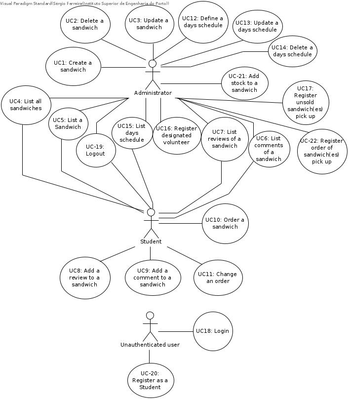

### Description

| Use Case                             | Description                                                                                                                           |
|--------------------------------------|---------------------------------------------------------------------------------------------------------------------------------------|
| UC-1: Create a sandwich              | An administrator creates a new sandwich and inserts it into the application                                                           |
| UC-2: Delete a sandwich              | An administrator deletes a sandwich in the application                                                                                |
| UC-3: Update a sandwich              | An administrator updates the contents of a sandwich                                                                                   |
| UC-4: List all sandwiches            | A student/administrator lists all sandwiches available                                                                                |
| UC-5: List a sandwich                | An student/administrator views a sandwich and all its characteristics                                                                 |
| UC-6: List comments of a sandwich    | A student/administrator views all comments of a sandwich                                                                             |
| UC-7: List reviews of a sandwich     | A student/administrator views all reviews of a sandwich, including its rating                                                         |
| UC-8: Add a review to a sandwich     | A student adds a review of a previously purchased sandwich                                                                            |
| UC-9: Add a comment to a sandwich    | A student adds a comment to a sandwich                                                                                                |
| UC-10: Order a sandwich              | A student orders a sandwich                                                                                                           |
| UC-11: Change an order               | A students changes an order of a sandwich, up to 5 days before the delivery                                                           |
| UC-12: Define a days schedule        | An administrator defines a schedule for a given day. The opening hours, ending hours and duration of delivery intervals are specified |
| UC-13: Update a days schedule        | An administrator updates the schedule for a given day                                                                                 |
| UC-14: Delete a days schedule        | An administrator deletes a schedule for a given day                                                                                   |
| UC-15: List days schedules           | An administrator/student lists the schedules for given days                                                                                   |
| UC-16: Register designated volunteer | An administrator registers a designated volunteer to the application which will be able to raise unsold sandwiches                    |
| UC-17: Register unsold sandwich(es) pick up    | A administrator registers a pick up of unsold sandwiches by a previously registered designated volunteer                                |
| UC-18: Login                         | An unauthenticated user logins into his account                                                                                       |
| UC-19: Logout                        | An administrator/student logs out of his account                                                                                      |
| UC-20: Register as a Student         | An unauthenticated user registers as a student                                                                                        |
| UC-21: Add stock to a sandwich         | An administrator adds a stock to a specific sandwich, updating its stock                                                              |
| UC-22: Register order of sandwich(es) pick up    | An administrator registers into the system that a student just picked up an order of sandwich(es)                                                     |

# ADD

## **Iteration 1**

### Step 1 - Review inputs

#### Quality Attribute Scenarios

The quality attribute scenarios are as following:

| ID   | Importance to the customer | Difficulty of Implementation According to the Architect |
| ---- | -------------------------- | ------------------------------------------------------- |
| QA-1 | Low                        | High                                                    |
| QA-2 | Medium                     | Medium                                                  |

QA-1 was considered low importance to the customer because of its low impact on the business. It is considered that it as a High difficulty of implementation since it will have a great impact on deciding the adopted architectural pattern

QA-2 was stated to have Medium importance to the customer and Medium Difficulty of implementation in a Quality Attribute Workshop.

The following table shows the inputs and goals to be considered for this iteration

| Category | Details |
|-|-|
| Type of system | Greenfield system in a mature domain |
| Design Purpose | Design and produce documentation to support the construction of the system |
| Primary functional requirements | From all the Use Cases, the primary are:                     |
|  | UC-1: It directly supports the core business. Sandwiches need to be created so students can order them |
|  | UC-4: It directly supports the core business. Sandwiches need to be listed for the students to choose what to order |
|  | UC-10: It directly supports the core business. This UC makes it possible for the students to order Sandwiches |
|  | UC-12: It directly supports the core business. A days schedule need to be defined so orders can be made for that day |
|  | UC-22: It directly supports the core business. The administrator needs to register what orders have been picked up |
| Quality attribute scenarios | QA-1, QA-2 |
| Constraints | All of the constraints previously presented are included as drivers |
| Architectural concerns | All of the constraints previously presented are included as drivers |

Several questions about the domain were answered by the stakeholder in sessions that spanned over several weeks

### Step 2 - Establish iteration goal and select inputs to be considered in the iteration

Iteration goal: Create an overall system structure

Inputs to be considered: All

### Step 3 - Choose one or more elements of the system to decompose

Since this is a greenfield system, the only element to decompose is the system itself

### Step 4 - Choose one or more elements of the system to decompose

It is necessary to select reference architectural patterns to support the system. This needs to be done for the server side, client side and deployment

### Determine the Application Type ###

The application type was chosen in the following way:

| Design decisions  |    To use        |       Rationale       |
|-------------------|------------------|-------------------------------------------------------------------------------------------------------------------------|
| Overall structure of the system | Web application |  This reference architecture is oriented toward the development of applications that are accessed from a web browser.[1]|
|  |   |  It is requested to use a simple single-page front end view.                                                            |

Some alternatives were discarded, which are the following:

| Design decisions                | Alternative                    | Reasons for discarding                                       |
| ------------------------------- | ------------------------------ | ------------------------------------------------------------ |
| Overall structure of the system | Application for mobile devices | This reference architecture is oriented toward the development of handheld devices. [1] This type of devices are not considered for accessing the system. |
|                                 | Rich client application        | The Rich Client Application (RCA) reference architecture supports the development of applications that installed in the users' PC. [1] These applications do not run in a web browser, so they are not be considered because we want to access our system from a web browser. |
|                                 | Rich Internet application      | This reference architecture is oriented toward the development of applications with a rich user interface that runs inside a web browser. [1] This type of application is not to be considered because a simple single-page front end view is requested. |

**Reference architecture**  **- Web application**

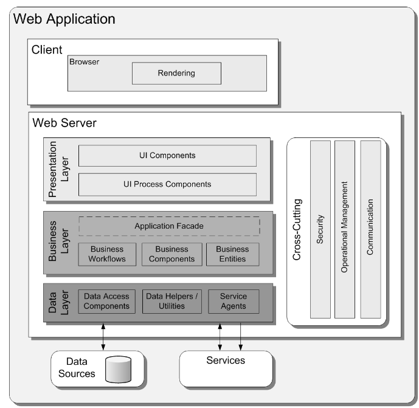

Image from Application Architecture Guide 2.0 [3] - Page 221

### Logically structure the  server part of the system

| Design Decisions and Location                                | Rationale                                                    | Driver     |
| ------------------------------------------------------------ | ------------------------------------------------------------ | ---------- |
| Locally structure the server part of the system using Hexagonal architecture reference architecture | There needs to be a separation of the application to the persistence layer. The application should be as agnostic as possible to this (CRN-2). Also it should be easy to add another persistence layer (QA-1). | CRN-2,QA-1 |
|                                                              | The hexagonal architecture makes it possible to swap data sources in the application without impacting the business logic of the application. Netflix tech blog states that "Having our core logic isolated means we can easily change data source details without a significant impact or major code rewrites to the codebase." (https://netflixtechblog.com/ready-for-changes-with-hexagonal-architecture-b315ec967749) | CRN-2,QA-1 |

The image below is a representation of Hexagonal architecture [2]:

### 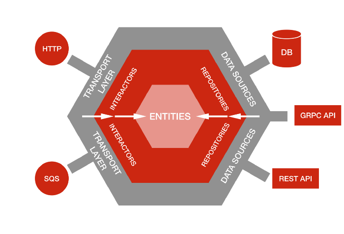

"The hexagonal architecture puts inputs and outputs at the edge of a design. In doing so, you isolate the central logic (the core) of your application from outside concerns." [5]

Each "layer" of the hexagon must provide an adapter will be consumed by the outer "layers" of the hexagon. At its core, the Entities (domain) are isolated from the rest of the application.

| Alternative        | Reason for discarding                                        |
| ------------------ | ------------------------------------------------------------ |
| Onion architecture | No relevant advantages were found in comparison to hexagonal architecture, which was already proven for the use case |
| Clean architecture | No relevant advantages were found in comparison to hexagonal architecture, which was already proven for the use case |

  

Image from *martinfowler.com* [12]

###  Physical structure of the application

The following decision was made for the physical structure of the application:

| Design Decisions and Locations                               | Rationale                                                    | Drivers            |
| ------------------------------------------------------------ | ------------------------------------------------------------ | ------------------ |
| Physically structure the application using a three-tier deployment pattern | Since the system must be accessed from a web browser (CON-5), a database server needs to be used for persistence storage of data (because we're using database connectors CON-9, CON-10), a three-tier deployment will be used in this application Is is a prototype, so more than three layers are not necessary for now since stress on the servers will be low | CON-5,CON-9,CON-10 |

The following diagram represents a three tiered architecture

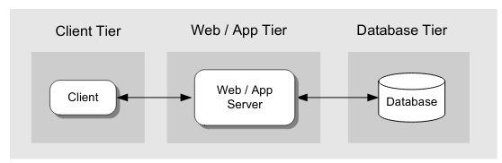

Image from Application Architecture Guide 2.0 [3] - Page 160

Alternatives were discussed, which were discarded:

| Alternative           | Reasons for discarding                                       |
| --------------------- | ------------------------------------------------------------ |
| Two-tier architecture | Two tier since a client that accesses the database directly is not being developed. The client needs to contact a REST API first (CON-4), which will then contact the database. |
| N-tier architecture   | N-tier since the application does not make heavy usage of resources in the server side, so there's no need to offload this work to another server |

### Other concepts

| Design Decisions and Location                                | Rationale     | Drivers |
| ------------------------------------------------------------ | ------------- | ------- |
| The server side of the application should have a RESTful API available | Satisfy CON-4 | CON-4   |

### Step 5 - Instantiate architectural elements, allocate responsibilities and define interfaces

#### Deciding the database system

A database database management system must be chosen for the application. The following table shows the choice and the rationale

| Alternative | Rationale |
|-|-|
| Postgres | The elements of the team are already familiar with it. And since there is not much time to build a prototype, we need technologies that the developers are already familiar with, for faster development |

#### Component diagram

The following components diagram was designed for the application:

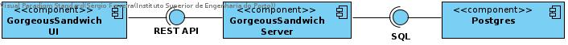  

The application will have three components:

- GorgeousSandwichUI: Frontend of the application which will run in the client browser
- GorgeousSandwichServer: Backend of the application, that servers RestfulAPI, consumed by GorgeousSandwichUI
- Postgres: A database component used for persistent storage, it provides a SQL interface consumed by GorgeousSandwichServer

The following table shows the responsibility for each component:

| Element                 | Responsibility                                               |
| ----------------------- | ------------------------------------------------------------ |
| GorgeousSandwichUI      | Frontend of the application. Will show all the data to users, which is retrieved by contacting GorgeousSandwichServer through a Restful API |
| GourgeousSandwichServer | Servers a Restful API that will retrieve, manage data and do all the business logic operations. All the data will be retrieved through Postgres through a SQL API |
| Postgres                | Database management system that will persist all the data    |

### Step 6 - Sketch views and record design decisions

#### Package Diagram

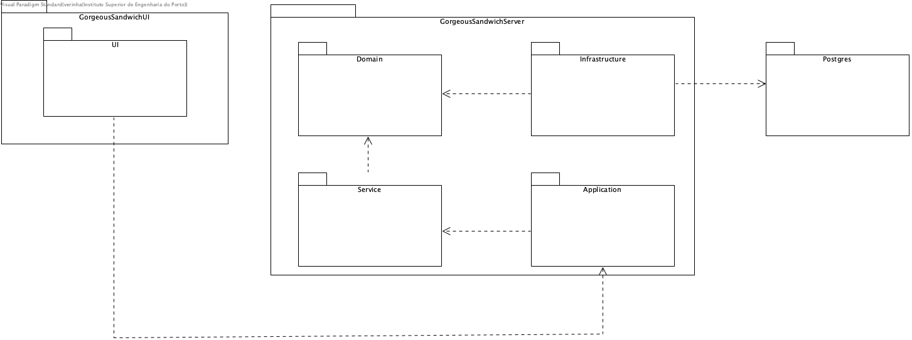

###### Responsibility Table

|    Element     | Responsibility                                               |
| :------------: | ------------------------------------------------------------ |
|       UI       | Contains all visual elements, components and all the UI elements of the website. |
|     Domain     | Contains all the entities and domains classes of the web application. |
|    Service     | This layer is responsible for all the logic and manipulation of the domain layer. |
| Infrastructure | Contains all the logic related to the access of the data base. |
|  Application   | Contains all the controllers and the rest component responsible to deal with objects for request and response. |
|    Postgres    | Package for all the database related files.                  |

### Deployment of the application

| Design Decisions and Location                                | Rationale                                                    | Drivers |
| ------------------------------------------------------------ | ------------------------------------------------------------ | ------- |
| Every component of the application will be deployed in a Docker container | Everyone on the team is comfortable with docker, having done containerized docker deployments before. This also addresses CON-3 | CON-3   |
| Every component of the application will be deployed in a separate machine | Follows the three-tier architecture, as chosen in step 4     |         |

The application will be deployed in separate physical machines (following a three layered architectural), with each physical machine hosting a docker container

| Alternative | Rationale | Drivers |
|-|-|-|
| Virtual Machine deployment | Docker deployments and re-deployments are faster than virtual machines [4] and with a tight prototype deadline, we need the deployments to happen as fast as possible (CON-1) | CON-1 |

The following diagram represents the deployment of the system

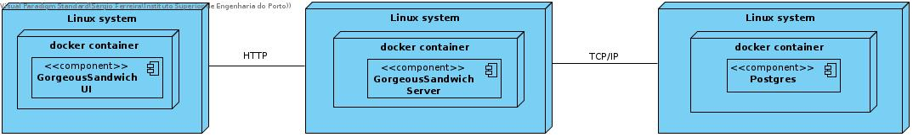

| Design Decisions                                           | Rationale                                                    |
| ---------------------------------------------------------- | ------------------------------------------------------------ |
| The docker containers should be deployed in a Linux system | Docker containers work better in Linux systems than in Windows/Mac OS systems |

### Technologies  ###

| Design decisions      |    Options       |   To use         |            Rationale                   |   Driver    |
|-----------------------|------------------|------------------|----------------------------------------|-------------|
|                       |    React         |                  |                                        |             |
| Simple SPA frontend   |    Angular       |   React          | The team members are familiar with it. |    CON-5    |
|                       |    Vue           |                  |                                        |    CON-7    |
|-----------------------|------------------|------------------|----------------------------------------|-------------|
|                       |  MySQL           |                  | New database.                          |             |
| Database              |  PostgreSQL      | PostgreSQL       | The team members are familiar with it. |   CON-7     |
|                       |  SQL Server      |                  |                                        |             |
|-----------------------|------------------|------------------|----------------------------------------|-------------|
| Persistence framework | Spring Data JPA  | Spring Data JPA  |                                        |   CON-9     |
|                       | Spring Data JDBC | Spring Data JDBC |                                        |   CON-10    |
|-----------------------|------------------|------------------|----------------------------------------|-------------|
| Persistence framework |  Hibernate       | Hibernate        | Hibernate is more mature, has a bigger |             |
| Spring Data JPA       |  EclipseLink     |                  | community and more documentation.      |             |
|-----------------------|------------------|------------------|----------------------------------------|-------------|
|                       |  Docker        |            |                         |             |
| Docker or Virtual Box             |  Virtual Box   | Docker | The team members are familiar with it. |   CON-7     |

### Kanban Board

| Not Addressed | Partially Addressed | Addressed |
| ------------- | ------------------- | --------- |
|               |                     | CRN-1     |
|               |                     | CRN-2     |
|               |                     | QA-1      |
| QA-2          |                     |           |
|               |                     | CON-1     |
| CON-2         |                     |           |
|               |                     | CON-3     |
|               |                     | CON-4     |
|               |                     | CON-5     |
| CON-6         |                     |           |
| CON-7         |                     |           |
| CON-8         |                     |           |
| CON-9         |                     |           |
| CON-10        |                     |           |

## **Iteration 2**  

### Step 1 - Review inputs

| Category                        | Details                                                      |
| ------------------------------- | ------------------------------------------------------------ |
| Design objectives               | Design and produce documentation to support the primary functionality and the quality attribute scenarios. |
| Primary functional requirements | From all the Use Cases, the primary are:                     |
|                                 | UC-1: It directly supports the core business. Sandwiches need to be created so students can order them. |
|                                 | UC-4: It directly supports the core business. Sandwiches need to be listed for the students to choose what to order. |
|                                 | UC-10: It directly supports the core business. This UC makes it possible for the students to order Sandwiches. |
|                                 | UC-12: It directly supports the core business. A days schedule need to be defined so orders can be made for that day. |
|                                 | UC-22: It directly supports the core business. The administrator needs to register what orders have been picked up. |
| Quality attribute scenarios     | QA-1, QA-2                                                   |
| Constraints                     | All of the constraints previously presented are included as drivers. |
| Concerns                        | All of the constraints previously presented are included as drivers. |

### Step 2 - Establish iteration goal and select inputs to be considered in the iteration

**Iteration goal:** Identify the elements that support the primary functionality.   
**Inputs to be considered:** UC-1, UC-4, UC-10, UC-12, UC-22, QA-1, QA-2

### Step 3 - Choose one or more elements of the system to decompose

Since the primary functionality is supported by elements that are spread across the layers of the system, the elements are the different layers that were identified in the previous iteration. 

### Step 4 - Choose design concepts that satisfy the selected drivers

Since the design decisions necessary to support need to take into account the quality attribute scenarios, we'll start with the Tactics regarding our quality attributes: *Modifiability* and *Localizability*.

For the quality attribute *Modifiability* we use the catalog available in Software Architecture in Practice [11] as represented in the image below. 

#### **Modifiability** 

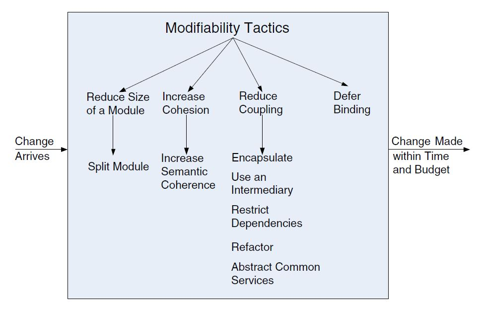  

Image from Software Architecture in Practice [11]

From this catalog we select the tactics, and the patterns that commonly used to solve this design problems. This way we establish a connection between potential design decisions intended to improve modifiability and the architectural tactics seen previously.

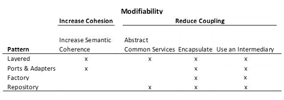  

| Design Decisions - Patterns | Rationale                                                    |
| --------------------------- | ------------------------------------------------------------ |
| Layered                     | Layers promote decreased coupling between layers and higher cohesion within, which promotes maintainability. The partitioning of the code into distinct and independent layers organized around a specific set of related concerns enables developers to work together better. [15]  The usage must be unidirectional. Layers completely partition a set of software, and each partition is exposed through a public interface. [11] |
| Ports & Adapters            | The *ports and adapters* (also known as Hexagonal Architecture) isolates core business logic so it can be used in a variety of contexts and tested in isolation from components that provide data and events. At runtime, pluggable adapters for specific input sources can be injected into the core business logic to provide access to events and data. Adapters can be swapped at build-time or runtime to create different configurations of the software system. [15] This way the *Domain Layer* is decoupled from the *Infrastructure Layer*  which makes it easy to replace the adapters without changing the business core code. It'll be necessary to develop mechanisms to select the adapters used at runtime. |
| Factory                     | The factory pattern provides intermediaries that convert the syntax of a service from one form into another. Hence, it can be used to prevent changes in A from propagating to B. [16] |
| Repository                  | A repository is a blackboard that acts only on data and does not manage the control aspects of data, thereby removing one aspect of the intermediary. [17] A Repository encapsulates the set of objects persisted in a data store and the operations performed over them, providing a more object-oriented view of the persistence layer. [18] |

TODO -  título a esta parte?

The persistence mode to be used (JPA or JDBC) will be chosen by a environment variable named *GORGEOUS_FOOD_PERSISTENCE_MODE*. If the value of that variable is jdbc, then jdbc will be used for persistence mode. If not, the JPA persistence mode will be used, which is the default.

Every time a Service Layer component needs to use the persistence layer it asks for a PersistencePort from a Factory. The following diagram shows the sequence of steps made when UserService asks for a UserPersistenceFactory

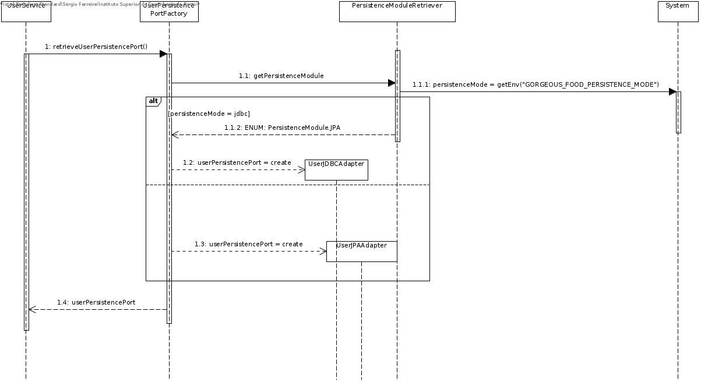

1. retrieveUserPersistencePort is called, which will return an Interface called UserPersistencePort, which is common for both Spring JPA and Spring Data JDBC implementations

2. getPersistenceModule method will retrieve an enum, which is either of value JPA or JDBC which indicates what persistence mode should be used. It chooses the persistence mode based on the environment variable *GORGEOUS_FOOD_PERSISTENCE_MODE*, as explained above

3. If the enum value is JDBC, then a userPersistencePort of type UserJDBCAdapter is created and returned from the factory. If the value is JPA, then UserJPAAdapter is created. Both are implementations f the UserPersistencePort interface, so both can be returned from the same method

4. UserService uses the persistence port provided without knowing which concrete implementation is being used. This is seamless because both implement the same interface

   

#### JPA

JPA is a Java specification for accessing, persisting and managing data between the Java objects and a relational database [7]. This is a specification, not a product, this means it cannot perform persistence by itself [7]. It's a set of interfaces and requires an implementation [7]. JPA also allows POJO or Plain Old Java Objects to be persisted without requiring the classes to implement any interfaces or methods [7].

#### JDBC

JDBC or Java Database Connectivity is an API that provides universal data access from the Java programming language [8]. This API can access virtually any data source and provides a common base on which tools and alternate interfaces can be built [8].

#### JPA and JDBC

To compare these two technologies, the following table was created:

| JPA                                                          | JDBC                                                         |
| ------------------------------------------------------------ | ------------------------------------------------------------ |
| Low level standard for interaction with databases [9].       | Higher level standard [9].                                   |
| Allows user to do more with the database directly but requires more attention [9]. | Allows to use an object model in the user's application [9]. |

### Entity Snapshot Pattern

According to the book, *Secure by Design*, in a high-performance software where performance and response times are critical it's crucial to avoid accessing the database. To improve this access Entities are represented with immutable objects [10]. An Entity Snapshot has an Entity but is not represented in code through a mutable entity class [10]. "Instead, there are snapshots of the entity that are used to look at that entity and take action. This is most easily described through a metaphor. Imagine an old friend who you haven’t seen in a while. You live in separate cities, but you keep in contact by following each other on a photo-sharing site. On a regular basis, you see photos of your friend, and you can follow how they change over time. Perhaps they try out a new hairstyle or move to a new house, and they certainly slowly grow older, as we all do. No doubt your friend is someone with an identity that transcends all these attribute changes. You see the changes and you stay in touch, although you never meet up in person (...) [10]". The following image better represents the example given.

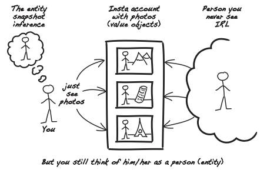

This image is from the book *Secure by Design* from D.  Johnsson, D.  Deogun and D.  Sawano [10].

#### **Localizability** 

According to Microsoft documentation, localizability is "(...) the process/practice to enable the software to be localized into different languages without any change to the source code" [13]. One of the Quality Attributes of this project was to assure the support for English and Portuguese languages. To assure the support of both languages there are two possible solutions: (i) using a solution on the backend or (ii) using a solution on the frontend.

If the localizability solution was applied on the backend, there are alot of options, such as i18n. According to Matt Raible, i18n is the process of making the application capable of rendering its text in multiple languages [14]. If localizability is applied on the backend side it would be less flexible and difficult to apply since none of the members have knowledge on applying i18n on Java.

After searching the possibilities on the frontend side, the team decided to use internationalization using a react package since it will be easier.

Since localizability will be done in the front-end and since the team will use React, a React package needs to be chosen for internationalization purposes. It does not make sense for the team do develop its own package, since the prototype needs a quick delivery and there are already industry proven packages for it.

The two most popular packages for react internationalization were analysed: react-intl and react-i18next. React-intl was chosen and the following table shows the rationale behind it:

| Design decisions                                  | To use     | Rationale                                                    | Driver |
| ------------------------------------------------- | ---------- | ------------------------------------------------------------ | ------ |
| Package to use for front-end internationalization | react-intl | Recently versions are published more frequently than react-i18next | CON-6  |
|                                                   |            | More weekly downloads, but not by much                       |        |
|                                                   |            | The documentation is clearer than in react-i18next           |        |

### Step 5 - Instantiate architectural elements, allocate responsibilities and define interfaces

### Sequence Diagram - UC1 - Add Sandwich

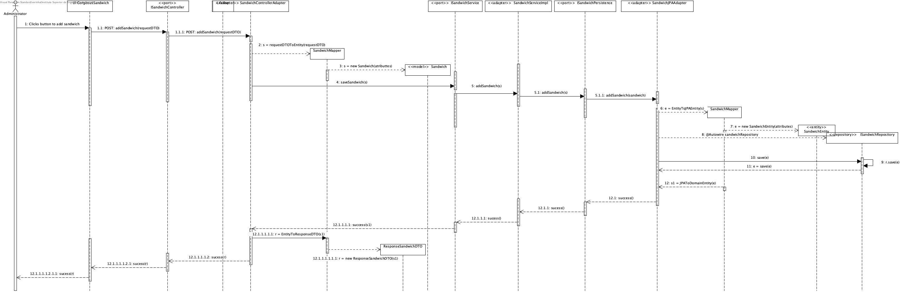

###### Responsibility Table

|                  Element                  | Responsibility                                               |
| :---------------------------------------: | ------------------------------------------------------------ |
|          addSandwich(requestDTO)          | This method handles the request to add a Sandwich between the frontend and the service side. |
|           Sandwich(attributes)            | Constructor of the class Sandwich.                           |
|             createSandwich(s)             | Persist the Sandwich in the database.                        |
|        SandwichEntity(attributes)         | Constructor of type SandwichEntity.                          |
|            createRepository()             | Create instance of type SandwichRepository.                  |
|                 success()                 | Send success message.                                        |
|    SandwichMapper.JPAToDomainEntity(e)    | Convert instance of Entitiy Domain to type Domain (example: coverts SandwichEntity to Sandwich). |
|   SandwichMapper.RequestDTOToEntity(r)    | Convert instance of resquestDTO to type Domain Entity        |
| SandwichMapper.DomainEntityToJPAEntity(d) | Convert instance of domain Entity To JPA entity.             |

### Sequence Diagram - UC4 - List all sandwiches

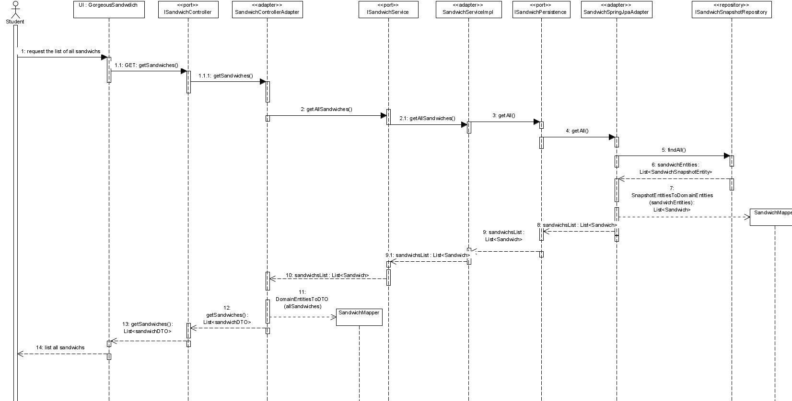  

In this diagram we represent the approach of using Spring Data JPA.  

| Element                                            | Responsibility                                               |
| -------------------------------------------------- | ------------------------------------------------------------ |
| getSandwiches()                                    | This method handles the request to list all Sandwiches between the frontend and the service side. |
| ISandwichController                                | In Application Layer. This interface handles all requests concerning the Sandwich. |
| SandwichControllerAdapter                          | In Application Layer. This class implements *ISandwichController* and is responsible for handling the communication between the application and the frontend. |
| SandwichMapper                                     | In Application Layer. This class maps the data in the DTO to a Domain Entity and from Domain Entity to DTO. |
| DomainEntitiesToDTO(allSandwiches)                 | Method that creates a list of Sandwich Entities by mapping the data in the RequestDTO. |
| ISandwichService                                   | In Service Layer. This interface handles the requests between the Application Layer and the Service Layer. |
| SandwichServiceImpl                                | In Service Layer. This class implements *ISandwichService*.  |
| ISandwichPersistence                               | In Domain Layer. This interface handles the communication of the other layers with this one. |
| SandwichSpringJpaAdapter                           | In Infrastructure. This class is one implementation of *ISandwichPersistence* and is responsible for handling the data access by using the JPA implementation. |
| ISandwichSnapshotRepository                        | In Infrastructure. This interface extends the *JPA Repository* and handles the data access to the SandwichSnaphot. |
| SandwichMapper                                     | In Infrastructure. This class maps the Snapshot Entity to a Domain Entity. |
| SnapshotEntitiesToDomainEntities(sandwichEntities) | Method that creates a list of Sandwich Entities by mapping the list of Snapshot Entities retrieved from the database. |

### Step 6 - Sketch views and record design decisions

### Package Diagram

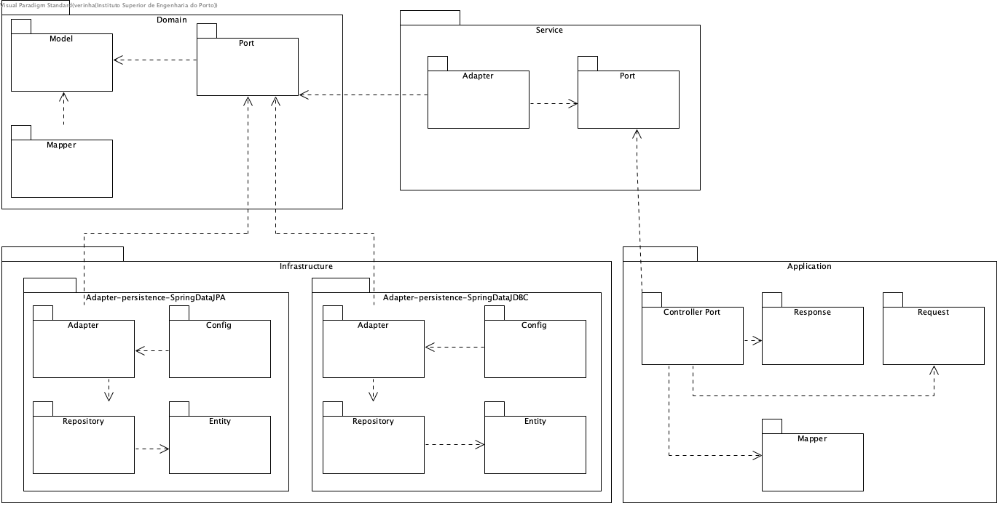

###### Responsibility Table

|           Element            | Responsibility                                               |
| :--------------------------: | ------------------------------------------------------------ |
|            Domain            | Contains all the entities and domains classes of the web application. |
|        Domain: Model         | Package that contains all the entities, value objects and domain primitives. |
|         Domain: Port         | Interface that handles all the communication between the domain and all the other packages [6]. |
|           Service            | This layer is responsible for all the logic and manipulation of the domain layer. |
|        Service: Port         | Port that handles all the communication between service and application. |
|       Service: Adapter       | This adapter handles all that data that is consuming from the model. |
|         Application          | Contains all the controllers and the rest component responsible to deal with objects for request and response. |
| Application: Controller Port | Port that handles all the communication between Service and Application. |
|    Application: Response     | This package handles all responses that will communicate with the outside. |
|     Application: Request     | Handles all the requests to different api.                   |
|        Infrastructure        | Contains all the logic related to the access of the data base. |
|   Infrastructure: Adapter    | This package handles all the data that is consuming from the model. |
|  Infrastructure: Repository  | This package has the files related. to specific methods to access the database. |
|    Infrastructure: Entity    | Has the specifications for each entity in the database.      |
|    Infrastructure: Config    | This package contains all the config files related to the specific database. |

### Persistence model

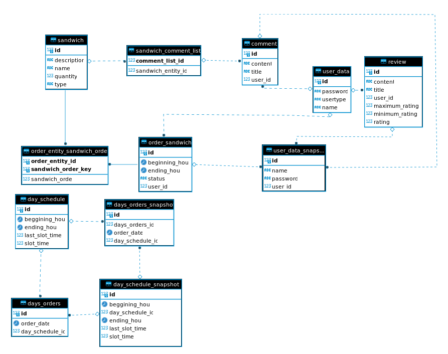  

### Step 7 - Kanban Board

| Not Addressed | Partially Addressed | Addressed |
| ------------- | ------------------- | --------- |
|               |                     | QA-1      |
|               |                     | QA-2      |
|               |                     | UC-1      |
|               |                     | UC-4      |
|               |                     | UC-10     |
|               |                     | UC-12     |
|               |                     | UC-22     |

## Lightweight ATAM

According to the book, *Fundamentals of Software Architecture* "every architecture has risk associated with it, wheter it be risk involving availability, scalability or data integrity" [19]. To evaluate the risk is necessary to use the following risk matrix. There are two dimensions, (i) overall impact of the risk and (ii) impact of the risk occurring. 

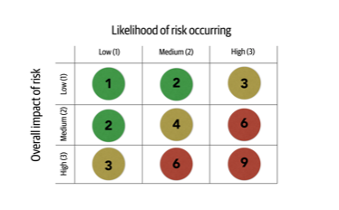

Figure used from the book *Fundamentals of Software Architecture* from page 693.

In the case of this project, the risk criteria will be the **quality attributes** that were defined before (**Modifiability** and **Localizability**) and other important risk criteria such as **Security** and **Performance**.

For the Use Cases used, the group decided to assess de risk of the following: (i) Create a Sandwich, (ii) Order a Sandwich, (iii) Define a days schedule, (iv) Register orders.

| Risk Criteria  | Create a Sandwich | Order a Sandwich | Define a days schedule | Register Orders | Total Risk |
| -------------- | ----------------- | ---------------- | ---------------------- | --------------- | ---------- |
| Modifiability  | 2                 | 3                | 3                      | 1               | 9          |
| Localizability | 1                 | 1                | 2                      | 3               | 7          |
| Security       | 2                 | 2                | 3                      | 3               | 8          |
| Performance    | 2                 | 4                | 4                      | 6               | 16         |
| Total Risk     | 7                 | 10               | 12                     | 13              |            |

This table represents several risks that this architecture has but the biggest risk is on the performance since it has 16 points of risk. The UC with more risk is Register Orders due to the performance.

[1] Cervantes, H., & Kazman, R. (2016). Designing software architectures: a practical
approach. Addison-Wesley Professional.

[2] Svrtan, D. and Makagon, S., 2020. *Ready For Changes With Hexagonal Architecture*. [online] Medium. Available at:  <https://netflixtechblog.com/ready-for-changes-with-hexagonal-architecture-b315ec967749> [Accessed 8 November 2020].

[3] M. (2009). *Microsoft® Application Architecture Guide (Patterns & Practices)* (2nd ed.). Microsoft Press.

[4] Maheshwari, Sumit & Deochake, Saurabh & De, Ridip & Grover, Anish. (2018). Comparative Study of Virtual Machines and Containers for DevOps Developers. 

[5] Vuollet, P. (2020, July 22). Hexagonal Architecture: What Is It and How Does It Work? Retrieved November 08, 2020, from https://blog.ndepend.com/hexagonal-architecture/

[6]"Ports & Adapters architecture on example", *Medium*, 2020. [Online]. Available:  https://wkrzywiec.medium.com/ports-adapters-architecture-on-example-19cab9e93be7. [Accessed: 08- Nov- 2020].

[7]"Java Persistence/What is JPA? - Wikibooks, open books for an open world", *En.wikibooks.org*, 2020. [Online]. Available: https://en.wikibooks.org/wiki/Java_Persistence/What_is_JPA%3F. [Accessed: 08- Nov- 2020].

[8]"Java JDBC API", *Docs.oracle.com*, 2020. [Online]. Available: https://docs.oracle.com/javase/8/docs/technotes/guides/jdbc/. [Accessed: 08- Nov- 2020].

[9]h.  JPA or JDBC, M.  D and P.  Solarski, "JPA or JDBC, how are they different?", *Stack Overflow*, 2020. [Online]. Available:  https://stackoverflow.com/questions/11881548/jpa-or-jdbc-how-are-they-different. [Accessed: 08- Nov- 2020].

[10]D.  Johnsson, D.  Deogun and D.  Sawano, *Secure by Design*. Shelter Island, NY: Manning Publications Co., 2019.

[11]Bass, L., Clements, P. and Kazman, R., 2013. Software Architecture In Practice. 3rd ed. Upper Saddle River (N.J.): Addison-Wesley.

[12] Fowler, M., 2015. *Presentationdomaindatalayering*. [online] martinfowler.com. Available at:  <https://martinfowler.com/bliki/PresentationDomainDataLayering.html> [Accessed 10 November 2020].

[13]"Localizability - Globalization", *Docs.microsoft.com*, 2020. [Online]. Available:  https://docs.microsoft.com/en-us/globalization/localizability/localizability. [Accessed: 18- Nov- 2020].

[14]"i18n in Java 11, Spring Boot, and JavaScript", *Okta Developer*, 2020. [Online]. Available:  https://developer.okta.com/blog/2019/02/25/java-i18n-internationalization-localization. [Accessed: 18- Nov- 2020].

[15] Keeling, Michael. Design It!: From Programmer to Software Architect. 2017 [Online] Available: Google e-book.

[16] Ece.ubc.ca*, 2020. [Online]. Available: http://www.ece.ubc.ca/~matei/EECE417/BASS/ch05lev1sec3.html. [Accessed: 18- Nov- 2020].

[17]  F. Bachmann, L. Bass, and R. Nord, “Modifiability Tactics,” *Softw. Eng. Inst. - Tech. Rep.*, no. CMU/SEI-2007-TR-002, 2007, [Online]. Available: www.sei.cmu.edu/publications/pubweb.html.

[18] "P of EAA: Repository", *Martinfowler.com*, 2020. [Online]. Available: https://martinfowler.com/eaaCatalog/repository.html. [Accessed: 18- Nov- 2020].

[19]N.  Ford and M.  Richards, *Fundamentals of Software Architecture*. Cambridge: O'Reilly Media, Incorporated, 2020.